# Volta Express V5

Um novo modelo de negócio com inteligência para logística.

A plataforma de prateleiras para dar match entre os anúncios de cargas e os transportadores cadastrados.

Propósito do Volta Express é criar oportunidades para a parte mais frágil da relação desse ecossistema de Logística.

## Pages

### Home

será o principal ambiente de divulgação da marca Volta Express

### Page Cadastrar

### Page quero transportar

#### Seção Home

- Qual o objetivo desse conteúdo?
- Qual a objeção superada?
- cta para levar para a lista ativa da ação principal
- cta para permitir anunciar

### Page quero carregar

#### Seção Home

- Qual o objetivo desse conteúdo?
- Qual a objeção superada?
- cta para levar para a lista ativa da ação principal
- cta para permitir anunciar

## Forms Jotform

Plataforma de solução para capturar informações.
Cada formulário com seus atributos e seus respectivos objetivos.

### cadastrar embarcador (Quem tem a carga)

### anunciar caminhão

### cadastrar transportador (Caminhoneiro)

### anuncar carga

## ROADMAP

### google meu negócio

### redes socias

## QA

Desenhar os testes

### DevOps

- [] fazer o domínio com volta express brasil: https://douglasabnovato.github.io/volta-express/

### PRIMEIRA TELA

- [x] Ao abrir no Edge , com 100% do zoom ele corta a frase "Entrar no Volta Express" que fica no menu ancoragem de bloco azul
- [x] A frase: "No Volta Express temos a sua solução!" a parte de "sua solução" está apagado. Sugestão mesma cor do Volta Express
- [x] Melhorar as duas frases em caixa azul e clicáveis
      sugestão: Tenho Caminhão e Busco Carga / Tenho Carga e Busco Caminhão
- [x] Botão principal está abrindo nova janela e não deve abrir nova janela para que possamos analisar via Google Analytics
- [x] Footer: Ícones de redes sociais: facebook, instagram , youtube, twitter

### TELA: TENHO CAMINHÃO E BUSCO CARGA

- [x] Trocar palavras em inglês para português
- [x] Melhor não ter no momento barra de pesquisa
- [x] No lugar de ter barra de pesquisa tem botão de CTA para levar para lista ativa e outro para levar para um formulário que o caminhoneiro anuncia sua disponibilidade de viagem (jotform)
- [x] Diminuir para 9 exposições de cargas
- [] criar paginas para ir navegando. Porém só navega quem tem cadastro ***
- [] Comportamento diferente no Edge e mais lento para carregar ***
- [] Mostrar nos cards o mapa, peso da carga, volume e data 

### TELA: TENHO CARGA E BUSCO CAMINHÃO

- [] Trocar palavras em inglês para português
- [] Melhor não ter no momento barra de pesquisa
- [] No lugar de ter barra de pesquisa tem botão de CPA para levar para lista ativa e outro para levar para um formulário que o remetente anuncia sua disponibilidade de carga (jotform)
- [] Criar paginas para ir navegando. Porém só navega quem tem cadastro
- [] Comportamento diferente no Edge e mais lento para carregar
- [] Mostrar nos cards o mapa, peso máximo que o caminhão suporta e data

### TELA: ENTRAR NO VOLTA EXPRESS

- [] Mudar texto de inglês para português
- [] Colocar formulário do jotform

# Volta Express V4

Um projeto de inteligência em logística e interação.

Um preview das últimas versões, 3 e 4, do projeto pois são importantes fluxos.

## versão 4.0 - Volta Express

- 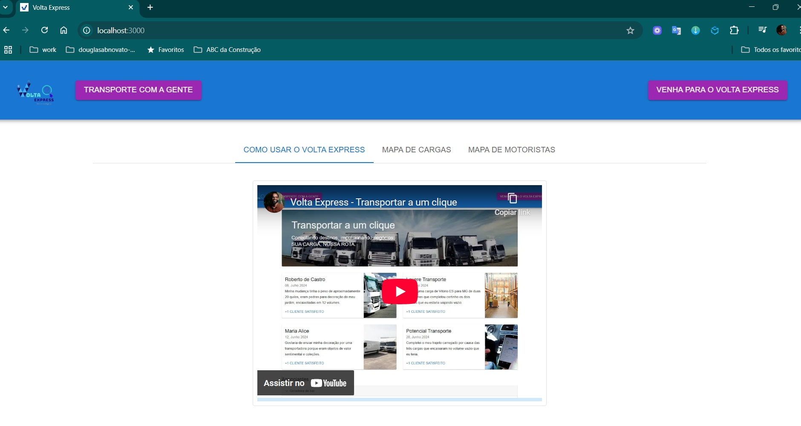

- 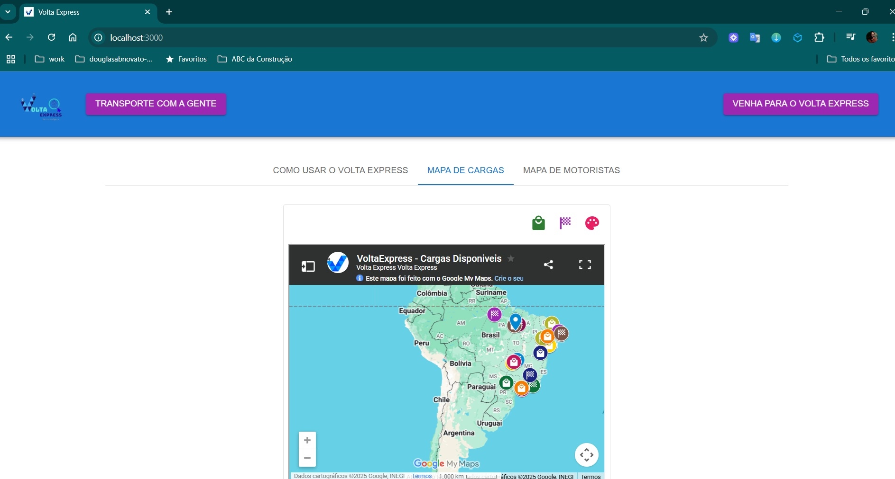

- 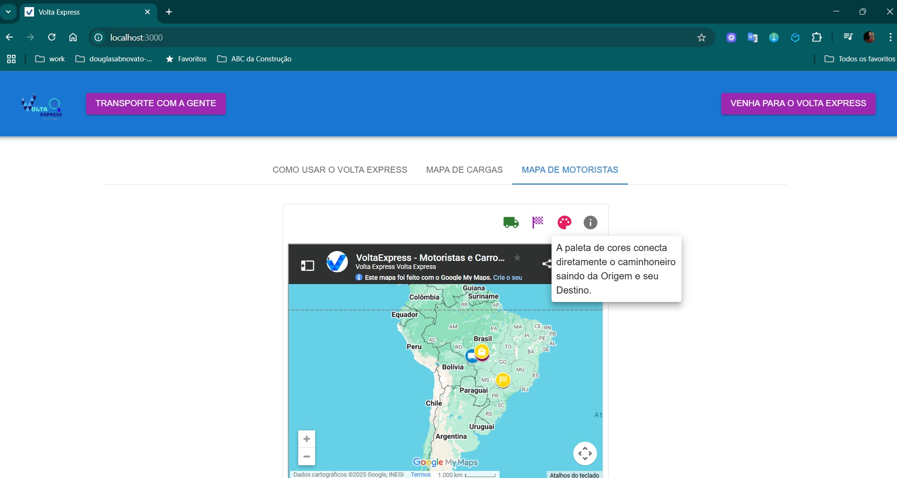

- 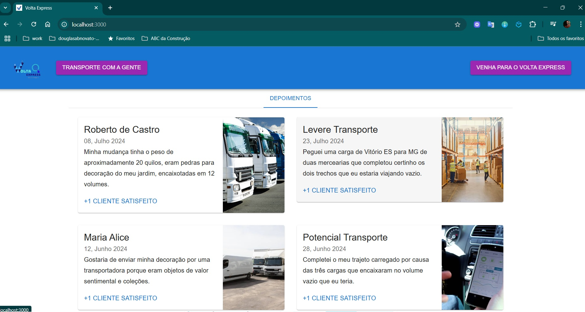

- 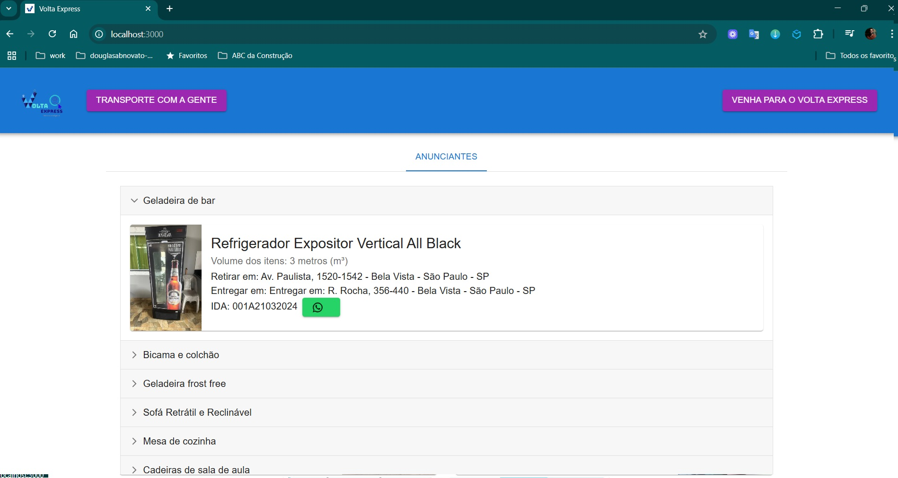

- 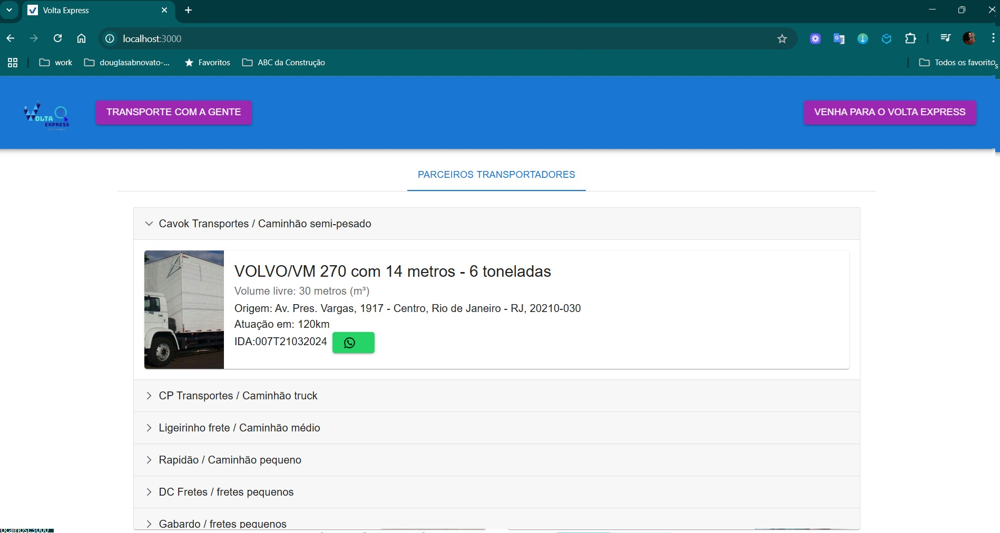

- 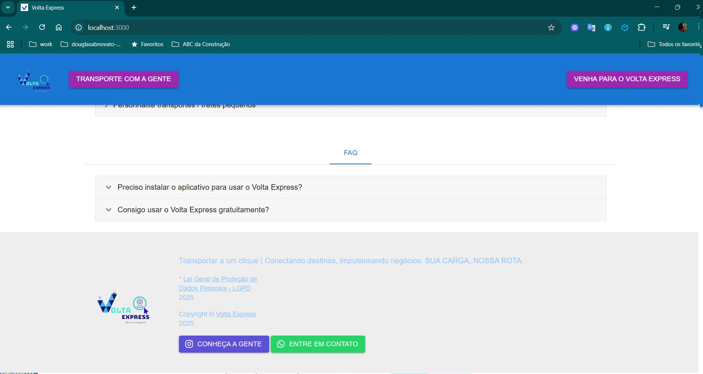

## versão 3.0 - Volta Express

- 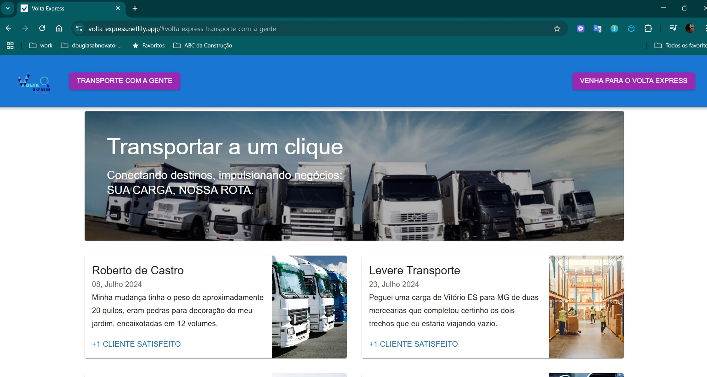

- 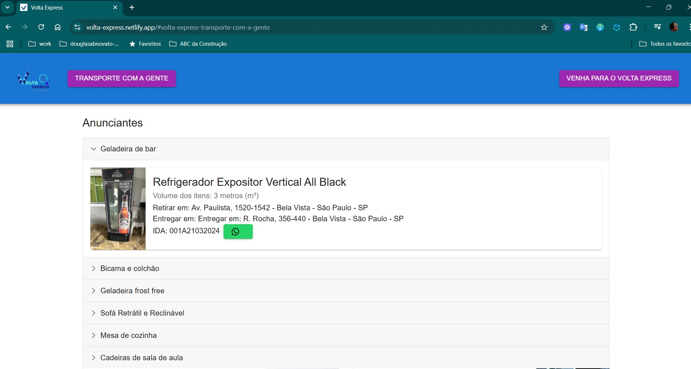

- 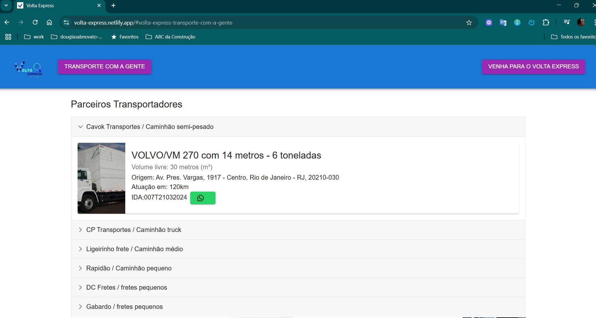

- 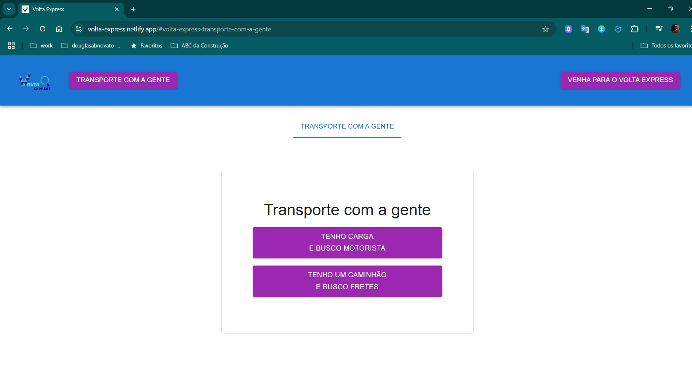

- 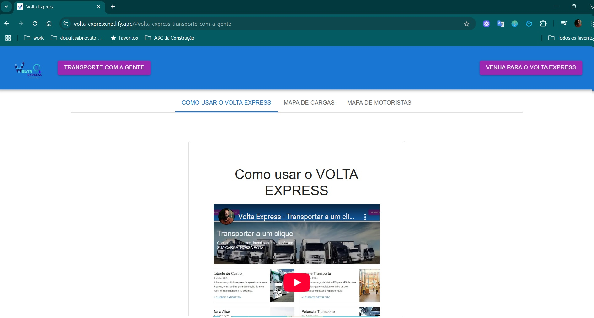

- 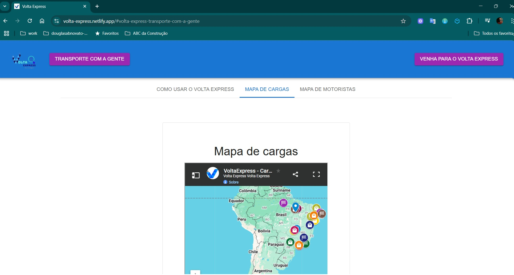

- 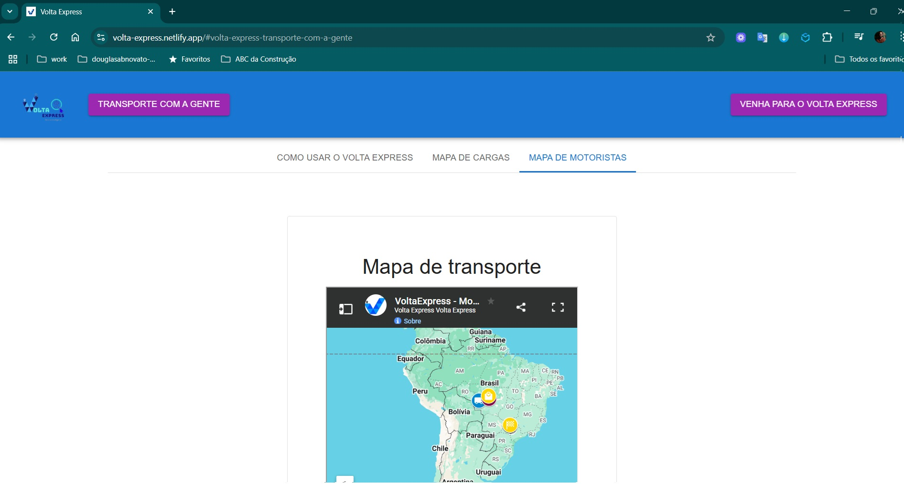

- 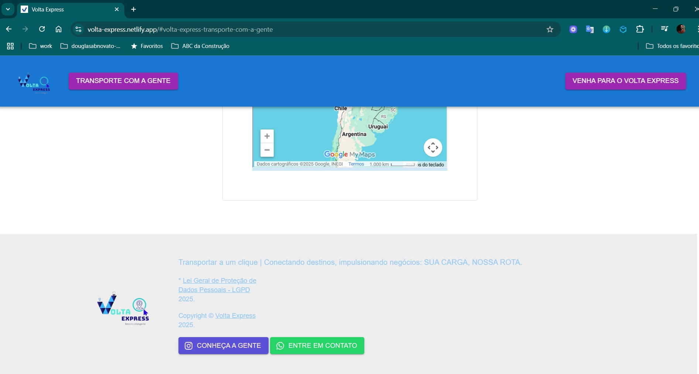

### Detalhes de Projetos

- Foco da plataforma é atrair a atenção de usuário
- Atração são funcionalidades e serviços que solucionam problemas dos clientes do nosso ecossistema
- Incluir o design do Google Maps para dentro da aplicação
- Analisar ciclo de vida dos usuários da plataforma.
- Cérebro: automação da interação das informações dos clientes
- DESAFIO: realizar mais viagens

### Gerais

- [x] Nossa equipe de suporte atende no whatsapp, 5532998615190
- [x] Forms para interação com clientes
  - [x] Formulários no domínio volta
  - [x] ter forms reservas
  - [x] permissão dos forms
  - [x] aperfeiçoar o copy dos formulários
- [x] Warnings: correções para hospedagem no servidor

### Seções em ordem com objetivo estratégico

- header
- como usar o volta express / mapa de cargas / mapa de motoristas
- banner
- transporte com a gente
- depoimentos
- anunciantes
- parceiros transportadores
- footer

### Portal MVP

- [x] Botão de contato: Número Whatsapp
- [x] Mobile: tres botões no hamburguer
- [x] Legenda: inserir uma legenda para os mapas (versão v4)
- [ ] Componente rect com google maps
- [ ] Novo form inteligente
  - [ ] Simples: para quem está querendo transportar a carga
    - [ ] origem
    - [ ] destino
    - [ ] data opcional (sumir quando chegar a data)
    - [ ] observações
    - [ ] contatos
  - [ ] Avançado: para caminhoneiro.
    - [ ] primeira pergunta:se a pessoa está em transito ou está aguardando
      - [ ] em trânsito
        - [ ] origem
        - [ ] destino
        - [ ] tipo de caminhao
        - [ ] contato
        - [ ] observações
      - [ ] está aguardando
        - [ ] origem
        - [ ] tipo de caminhão
        - [ ] contato
        - [ ] observações

### Marketing Digital

- [ ] Seção institucional Sobre
  - [ ] vídeo
  - [ ] membros da equipe
  - [ ] texto explicativo
- [ ] Seção Como usar
  - [ ] Vídeo com demonstração como usar as funcionalidades
    - [ ] dimensionar para mobile
    - [ ] Ferramentas usadas para gerar: wondershare filmora 14, obs studio, veed.io
  - [ ] Vídeo com montagem digital, self em ambiente de fundo
  - [ ] Texto explicativo com Imagem real de motorista, de anunciantes, de transportadoras
- [ ] Seção de Planos: opções das ofertas comerciais
- [ ] Copy: adicionar mais elementos
- [ ] Copy: aperfeiçoar o storytelling

### Redes Sociais

- [ ] Redes sociais Volta Express:
  - [x] [Instagram](https://www.instagram.com/voltaexpressbrasil): @voltaexpressbrasil
  - [ ] Facebook
  - [ ] Youtube: vídeos institucionais
  - [ ] Whatsapp

### Outbound para redes sociais

- [ ] Instagram / Facebook
  - [ ] Stories
  - [ ] Feeds
  - [ ] Vídeos Curtos
- [ ] Youtube
  - [ ] Vídeos Institucionais
- [ ] Whatsapp
  - [ ] Campanhas para aquecer os Leads
- [ ] Roadmap de disparos
- [ ] Roadmap de postagens

### Google Maps

- [x] mapa do geocode
- [x] adicionar os 2 mapas em abas conforme foco no clientDe
- [x] responsividade
- [x] abertura do mapa com mais zoom: Mundi, Brasil, Juiz de Fora
- [ ] Rota em destaque: cor no mapa
- [ ] Rota em texto: ordem das ruas
- [ ] Filtrar por palavra no mapa (autocomplete) - palavras chaves
- [ ] Estilizar os cards de informação
- [ ] Problema: "Nenhuma pessoa me contactou!": personalizar a mensagem do card.
- [ ] Destacar a rota ao clicar em um ícone da rota na origem ou no destino

#### Dados do marketing

- [ ] Saber que os anúncios funcionaram.
  - [ ] Funcionar significa que o transporte aconteceu por causa do _Volta Express_
- [ ] Google Ads
  - [ ] configurar na plataforma e capturar
  - [ ] entender as informações dos acessos com o Link em relatório
  - [ ] aperfeiçoar interações

### Relacionamento com os clientes

- [x] Whatsapp: botão de whatsapp para conversa
- [o] Seção feeback: espaço para OUVIR as pessoas para melhor direcionar (modelo newsletter)
- [x] Seção FAQ : 2 perguntas e respostas para esclarecimentos

#### Whatsapp

- [ ] ChatBot com a api do whatsapp para atendimento inteligente

### Processos

- Fluxo de Trabalho
- Fluxo de Operação
- Gestão de Negócio
- Gestão de Desenvolvimento
  - Branches do workflow: main, dev-volta-express-v4, volta-express-v4

#### TO-DO 19-11-2024

- [ ] atualizar informações do site - mergh
- [ ] atualizar to do no kaban teams - mergh
- [ ] subir funcionalidades no portal - novato
  - [x] legenda nos mapas
  - [x] transporte com a gente: ajustes de ux
  - [ ] atualizar vídeo

#### TO-DO 24-11-2024

- [ ] criar um form integrado a um bd que atualiza o mapa automaticamente - mergh
- [ ] o banco de dados sql - torres
- [ ] fazer a integração, forms, excel - torres e mergh

# Volta Express V3

- Focar no preenchimento dos formulários para permitir abordagens e anúncios dos stakeholders.

### Evoluções

- [x] Rodapé: Link para o documento oficial da LGPD
- [x] Rodapé: Botão de contato com Número Whatsapp

### Copies

- Os botões com textos com ordens das funcionalidades
- Os cards com textos atrativos para conversão

### Whatsapp e o suporte

- um botão de whatsapp nos anúncios com o número oficial

# Volta Express V2

O objetivo dessa aplicação é permitir anunciantes encontrarem parceiros transportadores para realizar seus transportes de mercadorias.

Também é nosso objetivo reduzir a zero o transporte a vazio dos veículos.

### Informações

- projeto nascido como Ferrex
- gestão do projeto detalhado no trello
- desenhar as regras de negócios no fluxo da aplicação
- esclarecer as funcionalidades
- esclarecer as tarefas de design
- validar novas funcionalidades
- desenvolver novas funcionalidades
- atualizar o mvp em produção

### Organização do projeto

- Componente da Página: Blog
- Componente da AppBar: Header
- Componente do Banner Principal: MainFeaturedPost
- Componente de Depoimentos: FeaturedPost
- Componentes dos Formulários: Blog
- Componente do Transporte com a gente: Checkout
- Componente do Rodapé: Footer

### Itens dos Formulários

- Formulário para Cadastrar
- Formulário do Anunciante
- Formulário do Parceiro Transportador

### Identidade Visual

As cores da aplicação em hexadecimal

- botão: #9C27B0
- azul: #1976D2
- true blue: #0073CF
- dark blue: #00008B
- blue gray: #6699CC
- royal blue: #4169E1
- misty blue: #A0AFB7

### Tarefas para desenvolver

- a responsividade dos componentes
- a posição dos botões
- o desenho do favicon

# Volta Express V1

- Seção Header
  - Logo
  - Botão transporte com a gente
  - Botão Venha para o volta express
- Seção Banner Principal
- Seção Depoimentos
- Seção Anunciantes
- Seção Parceiros Transportadores
- Seção Transporte com a gente
- Seção Mapas
- Seção Footer

### Hospedagem

servidor: Netlify
url: https://volta-express.netlify.app
