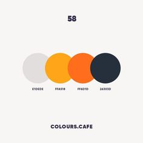
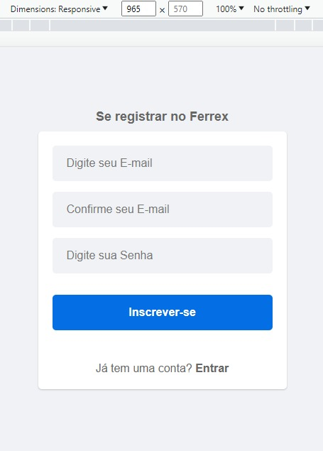
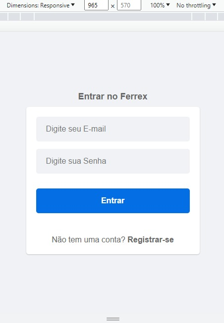
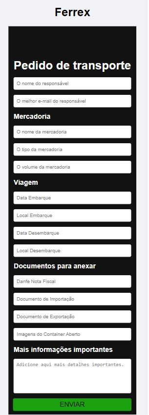
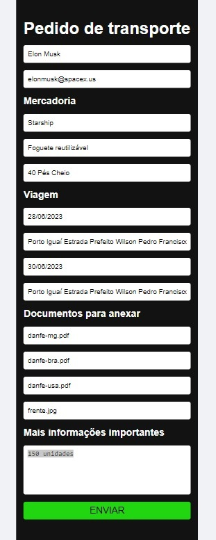
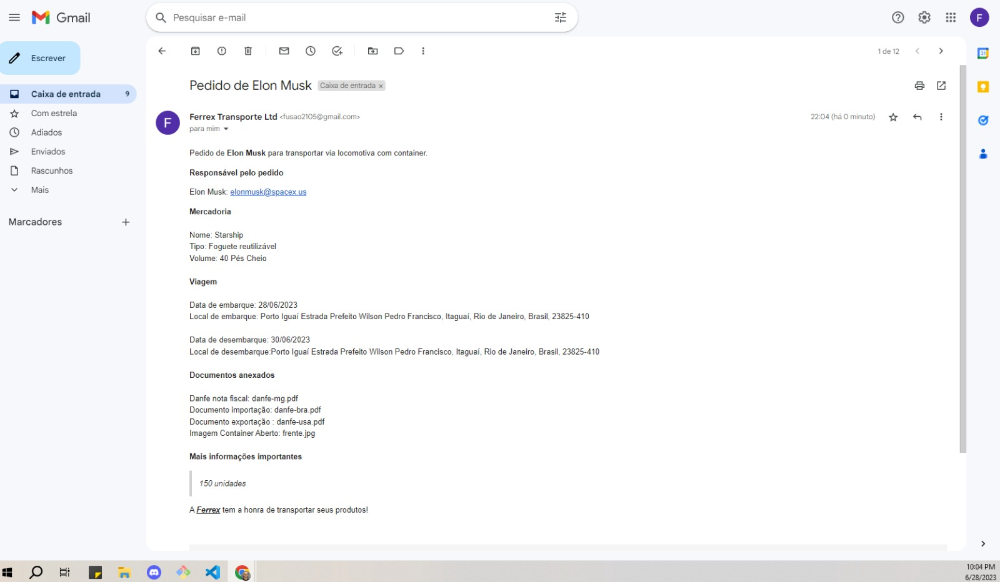

## Ferrex 

O desafio desse projeto é para uma página de login e cadastro.
Um formulário de pedido com informações importantes para enviar por email.

### Tarefas

- [ ] Página login
- [ ] Página register
- [x] Página pedido
- [ ] Identidade visual
- [ ] Responsividade

### Descrição de tarefas

#### Página login

- email e senha para entrar

#### Página register

Informações de cadastro com validação de código via email.
- Validação de novo usuário
- Telefone de contato e email de contato para validar via código por email

#### Página pedido

Preencher informações de pedido, enviar email, resposta de enviado.
- ferramenta de disparo de emails, emailsJS.
- informações de login e cadastro já preenchidas em tela. 
- header com logo e nome da aplicação, botão de sair.

#### Componentes da página de pedido

- [x] [dimensão, background, cores](https://www.youtube.com/watch?v=tIdNeoHniEY&list=WL&index=13)
- [ ] [Elementos no input para melhor o preenchimento do formulário de pedido](https://www.youtube.com/watch?v=oPteQFUK42w&list=WL&index=22)
- [ ] [Calendário, Lista de opções](https://www.youtube.com/watch?v=XSbMSSdGSdg)
- [ ] [Botão Sair redirecionar para o início com mensagem de agradecimento](https://www.freecodecamp.org/news/how-to-build-forms-in-react/)
- [ ] Campo mais informações sem obrigatoriedade 
- [ ] [Autopreenchimento de nome e email vindo de login](https://www.youtube.com/watch?v=PRSruHX_eig&list=PLs_UfelOxGL25jmkIJ4pU16Ku-jfdFGC4&index=32&t=136s)
- [ ] [submit form](https://www.youtube.com/watch?v=NVc_xY_dP-M&list=WL&index=14&t=408s)
- [ ] [validation form](https://www.youtube.com/watch?v=ajp8hmAKEhM&list=PLs_UfelOxGL25jmkIJ4pU16Ku-jfdFGC4&index=29)
- [ ] [components form](https://www.youtube.com/watch?v=5Heyc1z3ZAM&list=PLs_UfelOxGL25jmkIJ4pU16Ku-jfdFGC4&index=29)
- [ ] [components form](https://www.youtube.com/watch?v=Uv4h8IJhQUg&list=PLs_UfelOxGL25jmkIJ4pU16Ku-jfdFGC4&index=35&t=2s)
- [ ] [state form](https://www.youtube.com/watch?v=qH272VSWje4&list=PLs_UfelOxGL25jmkIJ4pU16Ku-jfdFGC4&index=33&t=1886s)
- [ ] [Upload de imagens](https://blog.rocketseat.com.br/upload-de-imagens-no-front-end-com-react-js-e-context-api-3/****)
- [ ] [autenticacao jwt](https://www.youtube.com/watch?v=pvrKHpXGO8E&list=WL&index=21)

#### Identidade visual

Inspiração de logo e icon para construir a identidade da aplicação.

   

  

Sugestão de paleta de cores para inspiração inicial.

   

 

Elementos de cores e combinações para melhor compor o design do frontend.
- [Color Style](https://m1.material.io/style/color.html#color-usability)
- [Color Style](https://m2.material.io/design/color/the-color-system.html)
- [Color Style](https://htmlcolorcodes.com/color-chart/material-design-color-chart/)
- [Color Style](https://materialui.co/colors/)
- [Color Style](https://mui.com/material-ui/customization/color/) 

#### Responsividade

- fluidez em smartphone e desktop.

### Gestão do projeto

- [ ] feature/login: Página login
- [ ] feature/register: Página register
- [ ] feature/pedido: Página pedido
- [ ] feature/pedido-components: componentes do formulário da Página pedido
- [ ] feature/identidade-visual: Identidade visual
- [ ] feature/responsividade: Responsividade

### Tecnologias

- NextJS
- Typescript
- Tailwindcss
- EmailJS

### Telas da aplicação
Estão na ordem do fluxo perfeito de uso.

- Registrar

   

 

- Entrar 

   

  

- Pedido de transporte

   

  

- Pedido preenchido

   

- Pedido recebido  

   

  

### Instruções de como usar

Como baixar, instalar as dependências e rodar o projeto na máquina local.

### Referências

- [Bonieky Lacerda](https://www.youtube.com/watch?v=iD94avNeoXM)
- [Sujeito programador](https://www.youtube.com/watch?v=Zbg1BHOVzRg)
- [Inspiração portal](https://www.brado.com.br/)
- [Docs Design](https://www.brado.com.br/wp-content/uploads/2016/10/AF_BRA_MANUAL_AGENDAMENTO_RODOV_170412.pdf)

### Desenvolvedores

- Douglas A. B. Novato - @douglasabnovato
- João Pedro Garcia - @jpedro_g2
